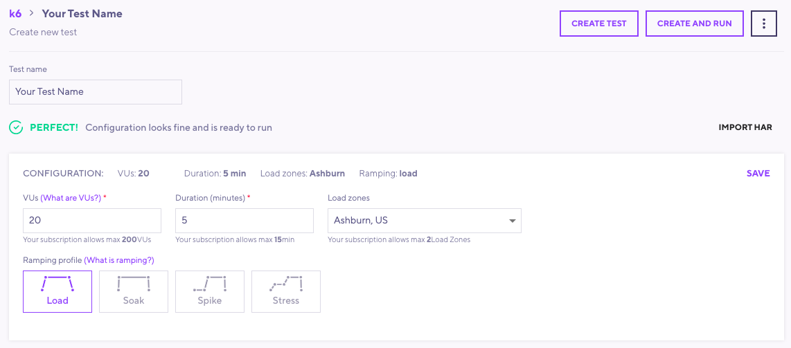
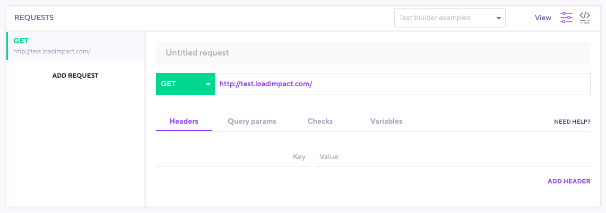

## Background

The k6 Test Builder allows you to utilize a graphical interface to create a test script.
Based on your inputs, we will automatically generate the proper required JavaScript to
execute the test within the app or from the command line. Use the Test Builder to help
speed up your scripting efforts.

> ### HAR Import
>
> The test builder also accepts importing a HAR file. When creating your HAR file, you
> should filter out third party requests and be mindful of your session length. Too many
> requests as a result of a long journey or third party requests will be overwhelming.

## Test Builder Configuration

The top configuration section allows to:

- `Create` (save) or `Create and Run` your test
- Give your test a meaningful name
- Import a HAR file
- Configure ramping, VUs, and duration

To input a HAR file, simply click on `IMPORT HAR` on the right, and select your file to be converted.
We will automatically populate the Test Builder with your requests, including any `Headers` sent.
You are able to modify/delete various parts of the requests to meet your requirements.

## Test Builder Requests

Whether you are importing a HAR file or starting from a blank slate, the `REQUESTS` section
allows you to explicitly control requests, the data sent with them, and even save data from the response.

Requests will be listed in order on the left. You can reorganize requests by clicking and dragging.
You can also duplicate or delete requests when hovering over a specific request.
To add a new request, click `ADD REQUEST`. Your test will execute in the order of these requests.

To modify requests, move over to the right side of the `REQUESTS` section. You are able to:

- Give your request a name to better describe it.
- Change the `HTTP METHOD` by using the drop down prepopulated with `GET`.
- Change the URL/Endpoint (This is predefine as `http://test.k6.io/` for example purposes)
- Specify Headers (If you have imported a HAR file, we will include some Headers here)
- Specify Query Parameters
- Create Checks
- Capture a variable (Helpful for dealing with dynamic data, such as authentication tokens)
- For POST/PUT/PATCH, you can also specify a request body (JSON, Text, or File Content)

> ### Examples
>
> We also include some examples of common actions. This is accessible by using the
> `Test builder examples` drop down in the title bar of the section. Use these for
> inspiration and guidance as you use the test builder.
>  
>
> **NOTE:** Choosing one of the examples will replace the current requests in the Test Builder.

## Test Builder Script

After you have completed building your requests. You can click on the `</>` in the
top right corner of the title bar to view the script we have generated for you.

This script is syntactically correct and may be used run right from the web app.
You may wish to copy it to your local IDE to place in version control, parameterize data,
or add more business logic. It's highly recommended to add some Thresholds.

If this is your first time using the Test Builder or k6. We recommend taking a moment to
familiarize yourself with the generated script and how the different parts relate to inputs.
For example, the option object reflects your configuration, names of requests are comments above the
actual requests, checks are implemented with requests, and more.

## See Also

- [Projects](/cloud/analyzing-results/analysis-tab)
