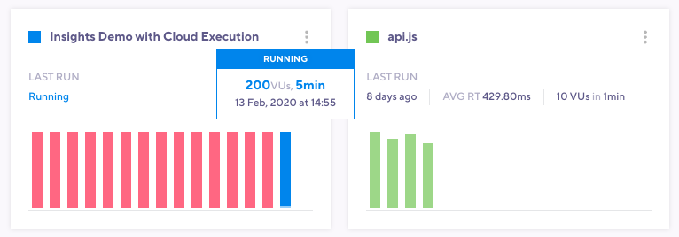
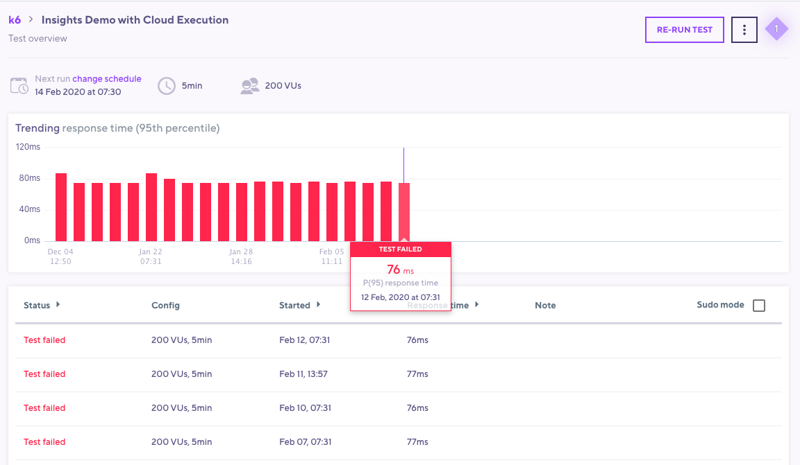

## Background

The performance trending graph is automatically created as you continue to run your tests. It's intended to provide a high level overview of your test performance over time. The bars on the graph also signal the status of a specific test. You are able to view the performance trending graph both from the dashboard, or by clicking on the name of any given test. In both cases we plot the `p95` response time metric for all HTTP requests from the test run.

## Dashboard Performance Trending

Directly from the dashboard you can see all of your tests and the status of the test runs. This view gives you a high level view of how performance is trending over time. In our example below, we can see a `Demo with Cloud Execution` is currently running, but had quite a few failures before this test run. Our script, `api.js` is passing and trending down, which is a good sign.

## Test Performance Trending

Clicking on the name of any of your tests will bring you to a performance trending graph for that specific test run. We show more data points over time in this graph. You can see more information by hovering over any bar in the graph. This test has stable response times between test runs, but is failing by [Thresholds](/using-k6/thresholds).

