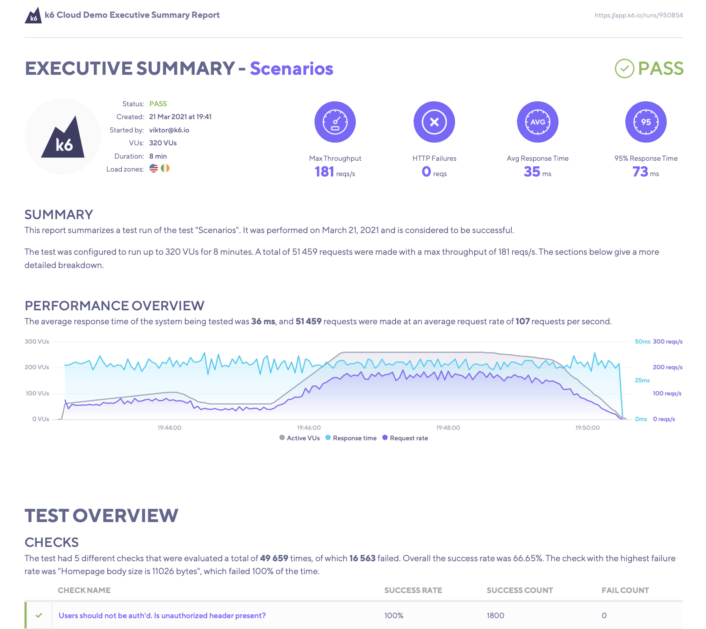

Test result data can be exported after a test has finished and data processing complete in various formats:
- [PDF report](#generate-pdf-report): to share the performance results with managers and executives.
- [CSV format](#export-as-csv): to analyze the test result metrics deeper on your own.

If you want to know other methods to analyze your test results, check out the k6 Cloud integrations with [APM tools](/cloud/integrations/apm) and the [Grafana Data Source Plugin](/cloud/integrations/grafana-plugin).

## Generate PDF report

> ⭐️ The PDF report is available on annual Pro and Enterprise plans.

To generate a PDF report from a test result, visit the test result, click the options menu - triple-dot button **⫶** in the top right - and select `Generate PDF summary`. After a few seconds, the browser will prompt you to download the PDF summary report.

The PDF report is an executive summary of the test result's most relevant metrics and performance data. A complete PDF example can be found [here](https://f.hubspotusercontent10.net/hubfs/1681264/Executive%20Summary%20-%20Scenarios.pdf).



## Export as CSV

To export the test result as CSV, visit the test result, click the options menu - triple-dot button **⫶** in the top right  - and select `Export Data`. The data will be exported as a `.tar.gz` file with a `.csv` contained inside.

The CSV data has the following columns of data:

<CodeGroup labels={[]}>

```bash
"time","metric","group_id","response_time","url","method","status","count","load_zone","tags"
```

</CodeGroup>

Here's example data, units (where necessary) and description of each field present in the CSV data.

| Column          | Example                          | Data/Unit      | Description                                                                                                                               |
| --------------- | -------------------------------- | -------------- | ----------------------------------------------------------------------------------------------------------------------------------------- |
| `time`          | 2019-03-25 11:12:48.927949+00:00 | datetime (UTC) | The ISO-8601 timestamp when this data point was captured (when the HTTP request was made).                                                |
| `metric`        | http_req_duration                | string         | The metric name that this data point represents.                                                                                          |
| `group_id`      | e1158ec16fa10dcfd16f4bd7309e2c55 | string         | The ID of the k6 [`group()`](/using-k6/tags-and-groups) from where this request was made.                                                 |
| `response_time` | 2.008016                         | number (ms)    | The HTTP response time of the request that this data point represents (if `count` > 1 then this will be an aggregate value, the average). |
| `url`           | http://test.k6.io/style.css      | string         | The URL requested.                                                                                                                        |
| `method`        | GET                              | string         | The HTTP method of the request that this data point represents.                                                                           |
| `status`        | 200                              | number         | The HTTP response status code of the request that this data point represents.                                                             |
| `count`         | 1.0                              | number         | Number of samples that this data point represents (if > 1 `response_time` is an aggregate value).                                         |
| `load_zone`     | amazon:us:ashburn                | string         | The load zone where the request(s) was made from.                                                                                         |
| `tags`          | staticAsset=true                 | string         | Pipe separated list of `name=value` tags as specified for the request in the script. |


> **Note**
> The exported CSV file currently only contains data from the primary HTTP response time metric (`http_req_duration`). In the future we'll expand the export feature with more HTTP data, WebSocket data, Checks data, Thresholds data as well as Custom metrics data.
