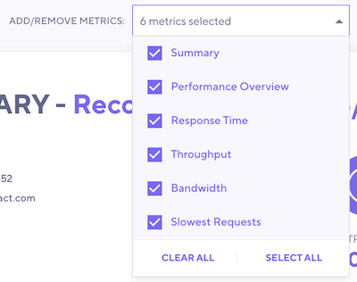

Test result data can be exported after a test has finished and data processing complete in various formats:

- [PDF report](#generate-pdf-report): to share the performance results with managers and executives.
- [CSV format](#export-as-csv): to analyze the test result metrics deeper on your own.

If you want to know other methods to analyze your test results, check out the k6 Cloud integrations with [APM tools](/cloud/integrations/cloud-apm) and the [Grafana Data Source Plugin](/cloud/integrations/grafana-plugin).

## Generate PDF Report

> ⭐️ The PDF report is available on annual Pro and Enterprise plans.

The PDF report is an executive summary of the test result's most relevant metrics and performance data. To get an idea of the report looks, you can download an example [here](https://f.hubspotusercontent10.net/hubfs/1681264/Executive%20Summary%20-%20Scenarios.pdf).


### Opening the Editor

To generate a PDF summary, do the following:

1. Navigate to the test result you want to generate a summary of.
2. Open the [test results menu](/cloud/analyzing-results/test-results-menu) in the top right.
3. Select the `Generate PDF summary` option.

This will take you to an editor where you can customize and download the summary.

### Adding or Removing Metrics

By using the Add/Remove Metrics-dropdown at the top of the page, it is possible to toggle which sections to include in the generated report. The editor comes with a variety of predefined metrics that can be included.



### Summarizing the Results

#### Editing


Each section in the summary comes with a predefined text. You can edit this text by clicking on the edit icon or by clicking on the text itself.

When you are satisfied with your changes, simply click outside the text editor to save your changes. If you want to cancel and revert your changes, you can click the cancel icon next to the editor or use the ESC key on your keyboard.

#### Formatting


You can apply formatting to your text by selecting the text you want to format and choosing the appropriate formatting from the popup. It's also possible to use the following keyboard shortcuts to apply formatting:

| Shortcut            | Format                                                    |
| ------------------- | --------------------------------------------------------- |
| Ctrl / &#x2318; + B | **Bold**                                                  |
| Ctrl / &#x2318; + I | _Italic_                                                  |
| Ctrl / &#x2318; + U | <span style="text-decoration: underline">Underline</span> |

### Generating the PDF

Once you've finished editing the summary, you can click the `Generate PDF` button in the top right of the editor. This will open up a progress dialog and, after a few moments, the browser will prompt you to download the PDF summary report.

> **Note:** It is important that you do not refresh or navigate away from the page while the PDF is being generated. The time it takes to generate the PDF is dependent on the amount of data that needs to be included, so it may take a minute if your test includes many load zones, for instance.

## Export as CSV

To export the test result as CSV, visit the test result, click the options menu - the three dots in the top right - and select `Export Data`. The data will be exported as a `.tar.gz` file with a `.csv` contained inside.

The CSV data has the following columns of data:

<CodeGroup labels={[]}>

```bash
"time","metric","group_id","response_time","url","method","status","count","load_zone","tags"
```

</CodeGroup>

Here's example data, units (where necessary) and description of each field present in the CSV data.

| Column          | Example                          | Data/Unit      | Description                                                                                                                               |
| --------------- | -------------------------------- | -------------- | ----------------------------------------------------------------------------------------------------------------------------------------- |
| `time`          | 2019-03-25 11:12:48.927949+00:00 | datetime (UTC) | The ISO-8601 timestamp when this data point was captured (when the HTTP request was made).                                                |
| `metric`        | http_req_duration                | string         | The metric name that this data point represents.                                                                                          |
| `group_id`      | e1158ec16fa10dcfd16f4bd7309e2c55 | string         | The ID of the k6 [`group()`](/using-k6/tags-and-groups) from where this request was made.                                                 |
| `response_time` | 2.008016                         | number (ms)    | The HTTP response time of the request that this data point represents (if `count` > 1 then this will be an aggregate value, the average). |
| `url`           | http://test.k6.io/style.css      | string         | The URL requested.                                                                                                                        |
| `method`        | GET                              | string         | The HTTP method of the request that this data point represents.                                                                           |
| `status`        | 200                              | number         | The HTTP response status code of the request that this data point represents.                                                             |
| `count`         | 1.0                              | number         | Number of samples that this data point represents (if > 1 `response_time` is an aggregate value).                                         |
| `load_zone`     | amazon:us:ashburn                | string         | The load zone where the request(s) was made from.                                                                                         |
| `tags`          | staticAsset=true                 | string         | Pipe separated list of `name=value` tags as specified for the request in the script.                                                      |
