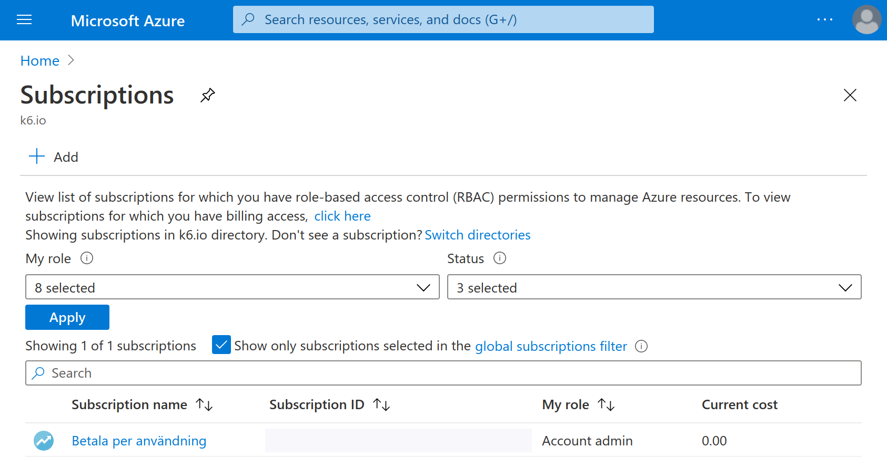
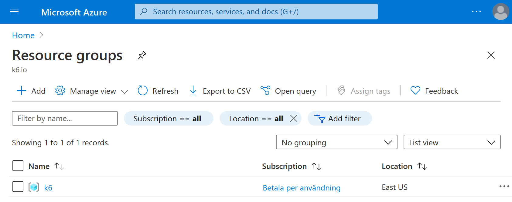
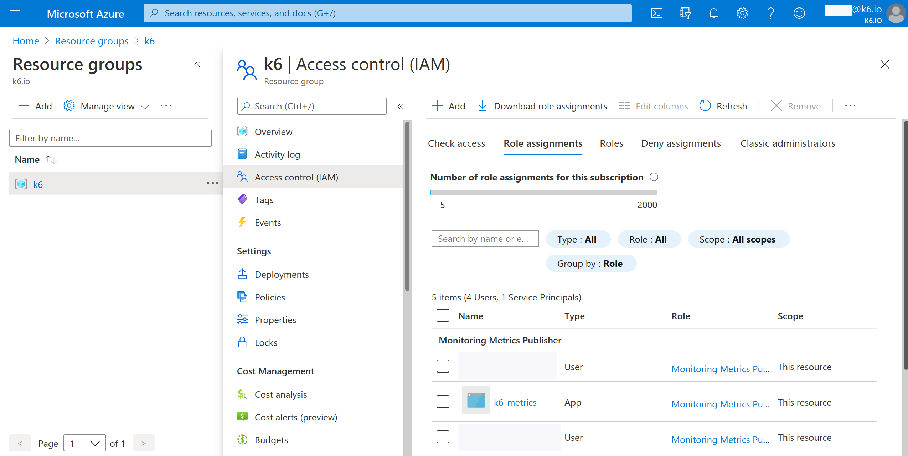
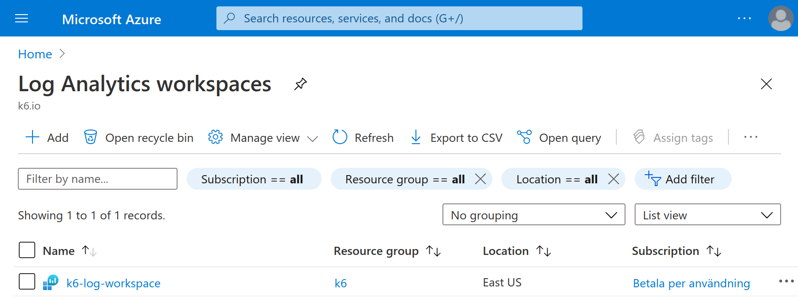
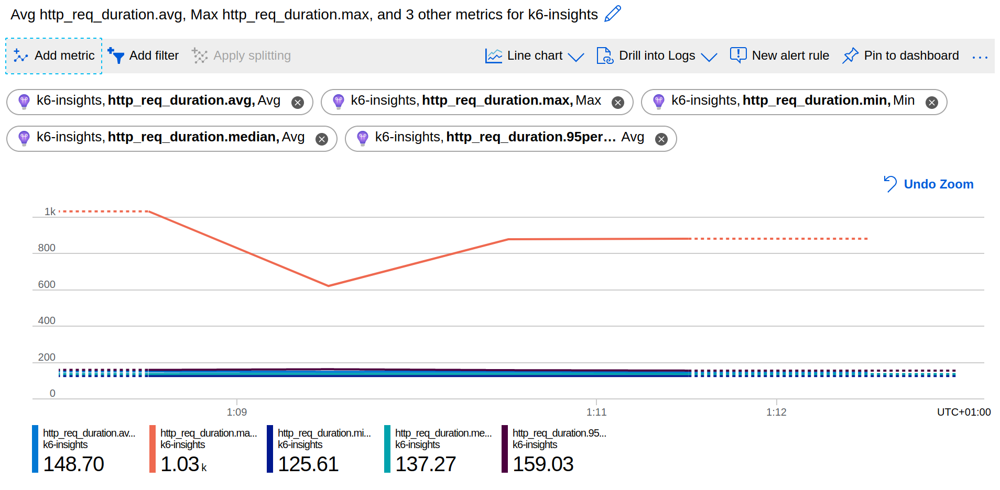

## Configuration Parameters

The configuration parameters for sending metrics to Azure Monitor are as follows:

| Name                      | Description                                                                                                                                                                                |
| ------------------------- | ------------------------------------------------------------------------------------------------------------------------------------------------------------------------------------------ |
| `provider`                | Any APM provider name available in the [supported APM provider](/cloud/integrations/cloud-apm#supported-apm-providers)'s table.                                                            |
| `tenantId`                | The `tenantId` provided by service principal. The directory (tenant) ID can be extracted from Azure's app registrations.                                                                   |
| `clientId`                | The `clientId` provided by service principal. The application (client) ID can be extracted from Azure's app registrations.                                                                 |
| `clientSecret`            | The `clientSecret` provided by service principal. The client secret can be extracted from the certificates & secrets section of Azure's app registrations.                                 |
| `azureRegion`             | The `azureRegion` you've created your Azure configurations. The [supported regions](#supported-regions) listed below can be used in Cloud APM. Default is `eastus`.                        |
| `subscriptionId`          | The `subscriptionId` can be viewed in the subscriptions section of Azure portal.                                                                                                           |
| `resourceGroupName`       | The `resourceGroupName` can be viewed in the resource groups section of Azure portal. It should match the `subscriptionId`.                                                                |
| `insights_app_name`       | The `insights_app_name` can be viewed in the application insights section of Azure portal. It should match the `resourceGroupName`.                                                        |
| `metrics`                 | List of built-in and custom metrics to be exported.                                                                                                                                        |
| `include_default_metrics` | If set, the export will include the default metrics. Default is `true`.                                                                                                                    |
| `resample_rate`           | The rate by which the metrics are resampled and sent to the APM provider in seconds. Default is 60 and constant, because Azure Monitor re-aggregates all metrics to 60 seconds by default. |
| `include_test_run_id`     | If set, the `test_run_id` will be exported per each metric as an extra tag. Default is `false`.                                                                                            |

## Example Configuration Object

All the above configuration parameters are passed like this in your test run.

```javascript
export let options = {
  ext: {
    loadimpact: {
      apm: [
        {
          provider: "azuremonitor",
          tenantId: "<Directory (tenant) ID>",
          clientId: "<Application (client) ID>",
          clientSecret: "<Client secret>",
          azureRegion: "<Region>",
          subscriptionId: "<Subscription ID>",
          resourceGroupName: "<Resource Group Name>",
          insights_app_name: "<Application Insights Name>",
          metrics: ["http_req_sending", "my_rate", "my_gauge", ...],
          include_default_metrics: true,
          include_test_run_id: false
        },
      ]
    },
  },
};
```

## Supported Regions

These are the supported regions for Azure Monitor integration:

| Geographic Region    | Supported Azure Region(s)                                                                                                              |
| -------------------- | -------------------------------------------------------------------------------------------------------------------------------------- |
| **US and Canada**    | `westcentralus`<br/>`westus2`<br/>`northcentralus`<br/>`southcentralus`<br/>`centralus`<br/>`canadacentral`<br/>`eastus`<br/>`eastus2` |
| **Europe**           | `northeurope`<br/>`westeurope`<br/>`uksouth`<br/>`francecentral`                                                                       |
| **Africa**           | `southafricanorth`                                                                                                                     |
| **Asia & Australia** | `centralindia`<br/>`australiaeast`<br/>`japaneast`<br/>`southeastasia`<br/>`eastasia`<br/>`koreacentral`                               |

## Azure Monitor Setup

For sending custom metrics from your test run Azure Monitor, follow these instructions:

1. You should have a active subscription on Azure to be able to proceed. Take note of your subscription ID for the configuration object.

    
2. Create a resource group under your active subscription.

    
3. Create a service principal by adding a new app to Azure app registrations.

    
4. Create a client secret in your service principal.

    
5. Go to your resource group and assign "Monitoring Metrics Publisher" role to the user and the service principal.

    
6. Create a log analytics workspace. The region is chosen here, so make note of it.

    
7. Create an app under application insights with your log analytics workspace. The region should match the log analytics workspace.

    
8. Start your test run with the parameters you've extracted from the steps 1-6.
9. Your metrics will be exported to Azure Monitor with a 3~4 minutes delay. You can view them on metrics section of the Azure Monitor. Just choose application insights name as scope, k6 as metrics namespace and your metrics (and their associated aggregation methods) will be shown in metric dropdown. If you didn't see the results, try to narrow down the time range to last 30 minutes or less.

    
