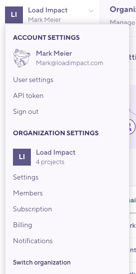

<Blockquote mod="warning">

<b>Team Members must specify a `projectID`</b>

Invited Team members must specify a `projectID` in `options.ext.loadimpact.projectID` of the options object of their test in order to use the subscription of the organization they have been invited to.

</Blockquote>

## Background

The Team Member functionality allows you to invite others users to gain access to your Organization and Subscription within the k6 web app. This make it easy to collaborate and share results to key stakeholders across your company.

---

## Adding Team Members

To add Team Members, click "Members" under "Organization Settings" in the drop down menu in the top left corner.



---

Next, click "Invite New Members"


---

Then, within the modal window, enter the email address and select a role for the user. For the Project Member permission role, users can be specifically assigned to projects. Admins are able to see all projects


---

## Specify a projectID

<div class="code-group" data-props='{"labels": []}'>

```javascript
export let options = {
  // Truncated for brevity
  ext: {
    loadimpact: {
      name: 'My Test Name',
      projectID: 1234567, // Replace with your projectID
      distribution: {
        scenarioLabel1: { loadZone: 'amazon:us:ashburn', percent: 50 },
        scenarioLabel2: { loadZone: 'amazon:ie:dublin', percent: 50 },
      },
    },
  },
};
```

</div>
