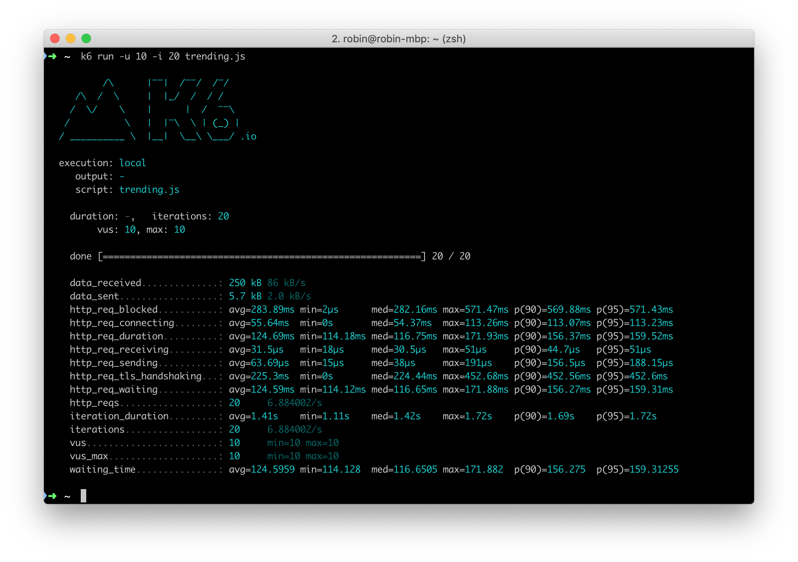
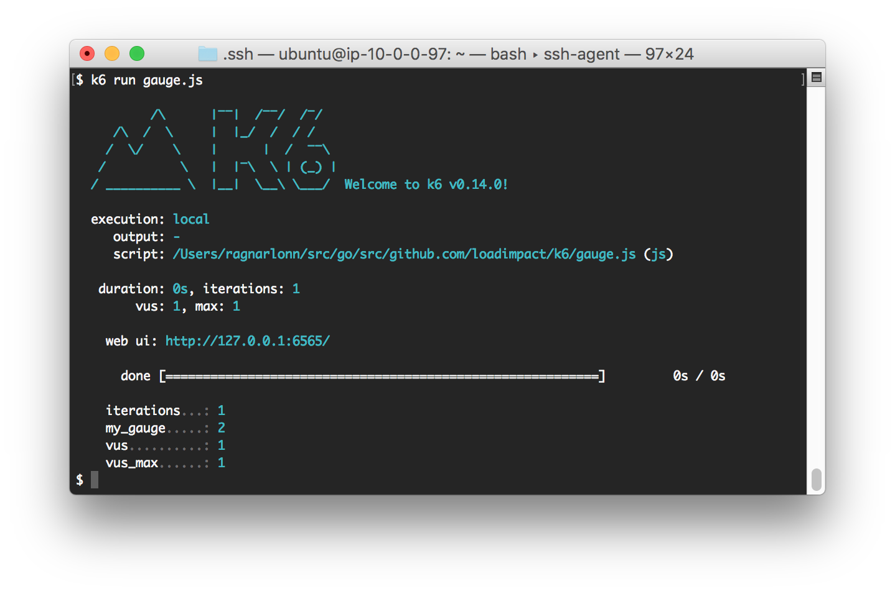
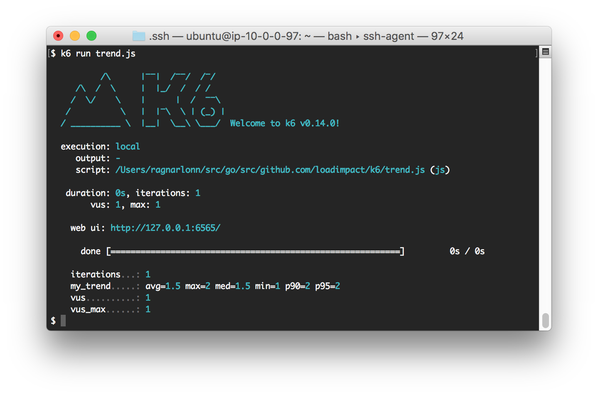
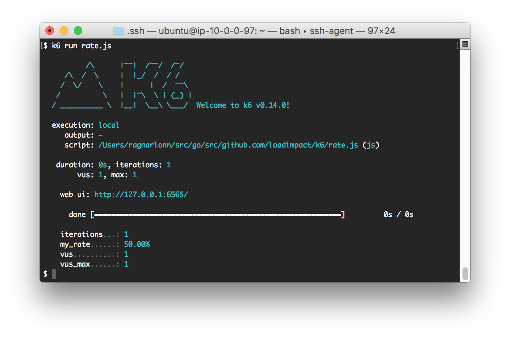

Esta sección cubre el importante aspecto de la gestión de métricas en k6. Cómo y qué tipo de métricas monitoriza k6 automáticamente (métricas incorporadas), y qué métricas personalizadas puede hacer que k6 monitorize.

## Métricas incorporadas

Las métricas incorporadas son las que puedes ver en la salida stdout cuando ejecutas la prueba k6 más simple posible, por ejemplo, `k6 run github.com/loadimpact/k6/samples/http_get.js` que mostrará algo como lo siguiente:


Todas las líneas `http_req_...` y las otras que siguen después son métricas incorporadas que se escriben en `stdout` al final de una prueba.


Las siguientes métricas incorporadas **siempre** serán recogidas por k6:

| Nombre de la métrica          | Tipo    | Descripción                                                                                                                                                                                                     |
| -------------------- | ------- | --------------------------------------------------------------------------------------------------------------------------------------------------------------------------------------------------------------- |
| `vus`                | Gauge   | Número actual de usuarios virtuales activos                                                                                                                                                                          |
| `vus_max`            | Gauge   | Número máximo posible de usuarios virtuales (los recursos de la VU están preasignados, para garantizar que el rendimiento no se vea afectado al aumentar el nivel de carga)                                                                |
| `iterations`         | Counter | El número agregado de veces que las VUs en la prueba han ejecutado el script JS (la función `default`)                                                                                                         |
| `iteration_duration` | Trend   | El tiempo que se tarda en completar una iteración completa de la función default/main.                                                                                                                                   |
| `dropped_iterations` | Counter | Introducido en k6 v0.27.0, el número de iteraciones que no pudieron iniciarse debido a la falta de VUs (para los ejecutores de tasa de llegada) o a la falta de tiempo (debido a la duración máxima expirada en los ejecutores basados en la iteración) |
| `data_received`      | Counter | La cantidad de datos recibidos. Lea este [ejemplo](/examples/track-transmitted-data-per-url) para monitorizar los datos de una URL individual.                                                                                 |
| `data_sent`          | Counter | La cantidad de datos enviados. Lea este [ejemplo](/examples/track-transmitted-data-per-url) para monitorizar los datos de una URL individual.                                                                                     |
| `checks`             | Rate    | El porcentaje de Checks exitosos.                                                                                                                                                                                  |

## Métricas integradas específicas de HTTP

Las métricas incorporadas sólo se generarán cuando/si se realizan peticiones HTTP:

| Nombre de la métrica          | Tipo    | Descripción                                                                                                                                                                                                     |
| -------------------------- | ------- | -------------------------------------------------------------------------------------------------------------------------------------------------------------------------------------------------------------------------------------------- |
| http_reqs                | Counter | Cuántas peticiones HTTP ha generado k6, en total.                                                                                                                                                                                           |
| http_req_blocked         | Trend   | Tiempo de bloqueo (espera de una ranura de conexión TCP libre) antes de iniciar la solicitud. `float`                                                                                                                                           |
| http_req_connecting      | Trend   | Tiempo de establecimiento de la conexión TCP con el host remoto. `float`                                                                                                                                                                           |
| http_req_tls_handshaking | Trend   | Tiempo de la sesión TLS de handshaking con el host remoto.                                                                                                                                                                                          |
| http_req_sending         | Trend   | Tiempo de envío de datos al host remoto. `float`                                                                                                                                                                                          |
| http_req_waiting         | Trend   | Tiempo de espera de la respuesta del host remoto (también conocido como "tiempo hasta el primer byte", o "TTFB\"). `float`                                                                                                                                       |
| http_req_receiving       | Trend   | Tiempo de recepción de datos de respuesta del host remoto. `float`                                                                                                                                                                             |
| http_req_duration        | Trend   | Tiempo total de la solicitud. Es igual a `http_req_sending +  http_req_waiting +  http_req_receiving`
(es decir, cuánto tiempo ha tardado el servidor remoto en procesar la solicitud y responder, sin los tiempos de búsqueda/conexión de DNS iniciales)
. `float` |

### Acceso a los tiempos de HTTP desde un script

Si desea acceder a la información de tiempo de una solicitud HTTP individual, las métricas de tiempo HTTP incorporadas también están disponibles en el objeto [HTTP Response](/javascript-api/k6-http/response):

<CodeGroup labels={["timings.js"]} lineNumbers={[true]}>

```javascript
import http from 'k6/http';
export default function () {
  var res = http.get('http://httpbin.org');
  console.log('Response time was ' + String(res.timings.duration) + ' ms');
}
```

</CodeGroup>

En el fragmento anterior, `res` es un objeto [HTTP Response](/javascript-api/k6-http/response) que contiene:

| Propiedad                      | Descripción                                                           |
| ----------------------------- | --------------------------------------------------------------------- |
| `res.body`                    | `string` que contiene el cuerpo de la respuesta HTTP                            |
| `res.headers`                 | `object`  que contiene pares de nombres de cabecera/valores de cabecera
                    |
| `res.status`                  | `integer` que contiene el código de respuesta HTTP recibido del servidor
          |
| `res.timings`                 | `object` que contiene información de tiempo HTTP para la solicitud en `ms` |
| `res.timings.blocked`         | = `http_req_blocked`                                                  |
| `res.timings.connecting`      | = `http_req_connecting`                                               |
| `res.timings.tls_handshaking` | = `http_req_tls_handshaking`                                          |
| `res.timings.sending`         | = `http_req_sending`                                                  |
| `res.timings.waiting`         | = `http_req_waiting`                                                  |
| `res.timings.receiving`       | = `http_req_receiving`                                                |
| `res.timings.duration`        | = `http_req_duration`                                                 |

## Métricas personalizadas

También puede crear sus propias métricas, que se reportan al final de una prueba de carga, al igual que los tiempos HTTP:

<CodeGroup labels={["trend.js"]} lineNumbers={[true]}>

```javascript
import http from 'k6/http';
import { Trend } from 'k6/metrics';

let myTrend = new Trend('waiting_time');

export default function () {
  let r = http.get('https://httpbin.org');
  myTrend.add(r.timings.waiting);
}
```

</CodeGroup>

El código anterior creará una métrica de tendencia llamada "waiting_time" y se referirá a ella en el código utilizando el nombre de variable myTrend. Las métricas personalizadas serán reportadas al final de una prueba. Así es como podría verse la salida:



## Tipos de métricas


Todas las métricas (tanto las incorporadas como las personalizadas) tienen un tipo. Los cuatro tipos de métricas diferentes en k6 son:

| Metric type                                   | Description                                                                                              |
| --------------------------------------------- | -------------------------------------------------------------------------------------------------------- |
| [Counter](/javascript-api/k6-metrics/counter) | Una métrica que suma los valores añadidos de forma acumulativa.
                                                           |
| [Gauge](/javascript-api/k6-metrics/gauge)     | Una métrica que almacena los valores mínimos, máximos y últimos añadidos.                                           |
| [Rate](/javascript-api/k6-metrics/rate)       | Una métrica que registra el porcentaje de valores añadidos que son distintos de cero.                                  |
| [Trend](/javascript-api/k6-metrics/trend)     | Una métrica que permite calcular estadísticas sobre los valores añadidos (mínimo, máximo, media y percentiles).. |

All values added to a custom metric can optionally be [tagged](/using-k6/tags-and-groups) which can be useful when analysing the test results.

Todos los valores añadidos a una métrica personalizada pueden ser opcionalmente [etiquetados (tags)](/using-k6/tags-and-groups), lo que puede ser útil al analizar los resultados de las pruebas.

### Counter (métrica acumulativa)

<CodeGroup labels={["counter.js"]} lineNumbers={[true]}>

```javascript
import { Counter } from 'k6/metrics';

let myCounter = new Counter('my_counter');

export default function () {
  myCounter.add(1);
  myCounter.add(2);
}
```

</CodeGroup>

El código anterior generará la siguiente salida:


El valor de `my_counter` será 3 (si se ejecuta una sola iteración, es decir, sin especificar --iterations o --duration).
 
Tenga en cuenta que actualmente no hay forma de acceder al valor de ninguna métrica personalizada desde JavaScript. Tenga en cuenta también que los contadores que tienen valor cero (0) al final de una prueba son un caso especial - NO se imprimirán en el resumen del stdout.

### Gauge (mantenga sólo el último valor)


<CodeGroup labels={["gauge.js"]} lineNumbers={[true]}>

```javascript
import { Gauge } from 'k6/metrics';

let myGauge = new Gauge('my_gauge');

export default function () {
  myGauge.add(3);
  myGauge.add(1);
  myGauge.add(2);
}
```

</CodeGroup>

El código anterior dará como resultado una salida como ésta:



El valor de `my_gauge` será 2 al final de la prueba. Al igual que con la métrica Counter anterior, un Gauge con valor cero (0) NO se imprimirá en el resumen stdout al final de la prueba.

### Trend (recolecta las estadísticas de la tendencia (mín/máx/avg/percentiles) para una serie de valores)

<CodeGroup labels={["trend.js"]} lineNumbers={[true]}>

```javascript
import { Trend } from 'k6/metrics';

let myTrend = new Trend('my_trend');

export default function () {
  myTrend.add(1);
  myTrend.add(2);
}
```

</CodeGroup>

El código anterior hará que k6 imprima una salida como esta:



Una métrica de tendencia es un contenedor que contiene un conjunto de valores de muestra, y al que podemos pedirle que imprima estadísticas (mínimo, máximo, media, mediana o percentiles) sobre esas muestras. Por defecto, k6 imprimirá la media, el mínimo, el máximo, la mediana, el percentil 90 y el percentil 95.

### Rate (realiza el tracking de la cuenta del porcentaje de valores de una serie que son distintos de cero)


<CodeGroup labels={["rate.js"]} lineNumbers={[true]}>

```javascript
import { Rate } from 'k6/metrics';

let myRate = new Rate('my_rate');

export default function () {
  myRate.add(true);
  myRate.add(false);
  myRate.add(1);
  myRate.add(0);
}
```

</CodeGroup>

El código anterior hará que k6 imprima una salida como esta:



El valor de `my_rate` al final de la prueba será del 50%, lo que indica que la mitad de los valores añadidos a la métrica eran distintos de cero.

### Notas

- las métricas personalizadas sólo se recogen de los hilos de la VU al final de una iteración de la VU, lo que significa que para los scripts de larga duración, es posible que no vea ninguna métrica personalizada hasta que haya pasado un tiempo de la prueba.

## Gráficos métricos en k6 Resultados de la nube

Si utiliza k6 Cloud, tendrá acceso a todas las métricas de las pruebas en la [pestaña Analysis](/cloud/analyzing-results/analysis-tab). Puede utilizar esta pestaña para analizar y comparar más a fondo los datos de los resultados de las pruebas, para buscar correlaciones significativas en sus datos.


