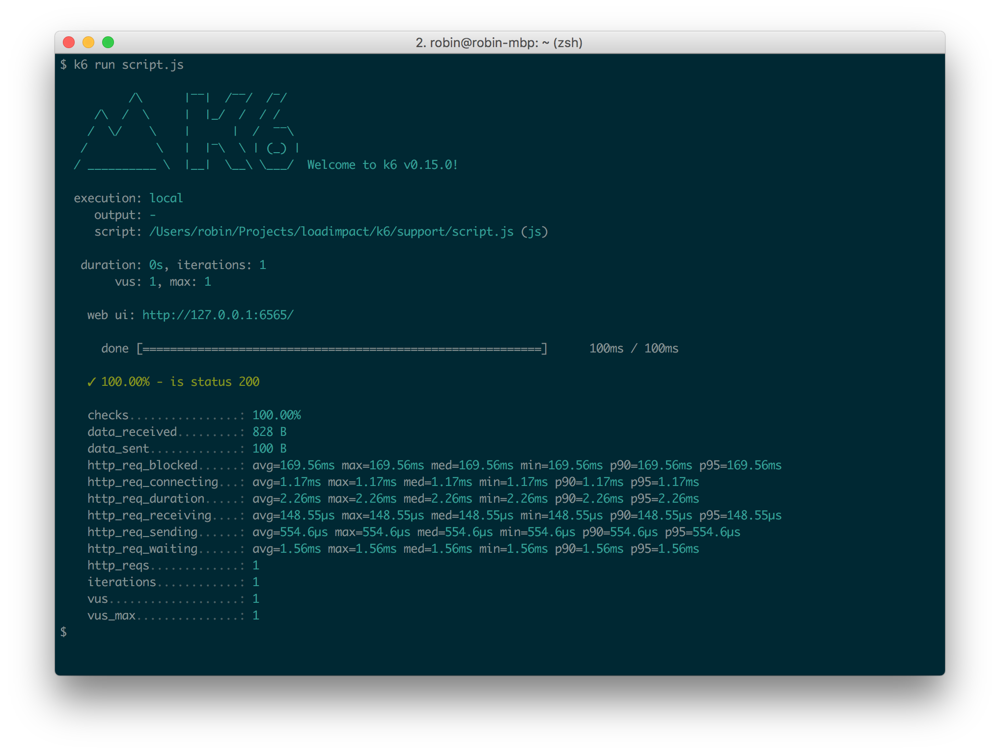
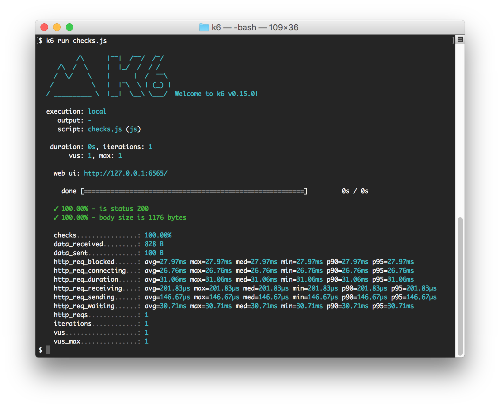
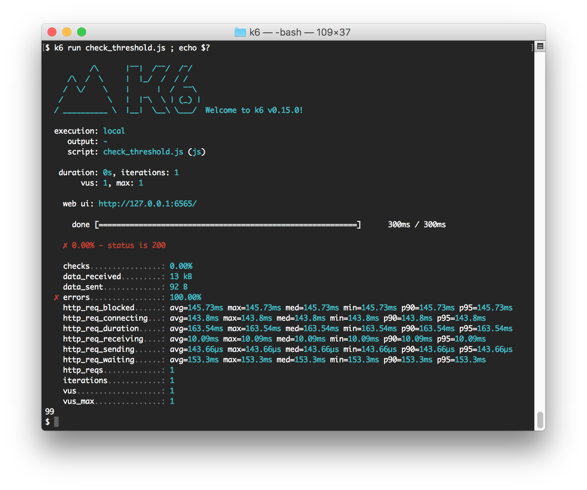

## ¿Qué es un check?


`Checks` son como las aserciones, pero difieren en que no detienen la ejecución, en su lugar, sólo almacenan el resultado de la comprobación, pase o no, y dejan que la ejecución del script continúe. Echa un vistazo a [Thresholds](/using-k6/thresholds) para una forma de detener la ejecución. `Checks` son excelentes para codificar aserciones relacionadas con peticiones/respuestas HTTP, asegurándose de que el código de respuesta es 2xx, por ejemplo:

<CodeGroup labels={["check.js"]} lineNumbers={[true]}>

```javascript
import { check } from 'k6';
import http from 'k6/http';

export default function () {
  let res = http.get('http://test.k6.io/');
  check(res, {
    'is status 200': (r) => r.status === 200,
  });
}
```

</CodeGroup>

En el ejemplo anterior, se especificó una comprobación, pero puede añadir tantas como necesite en una llamada a [`check()`](/javascript-api/k6/check-val-sets-tags). Cuando se ejecuta el script anterior se puede ver cómo k6 muestra los resultados de las llamadas de comprobación en la siguiente salida:



En la salida anterior puede ver que nuestra comprobación "is status 200" tuvo éxito el 100% de las veces que fue llamada.

También puede añadir múltiples comprobaciones dentro de una única sentencia check(), como esta:


<CodeGroup labels={["checks.js"]} lineNumbers={[true]}>

```javascript
import { check } from 'k6';
import http from 'k6/http';

export default function () {
  let res = http.get('http://test.k6.io/');
  check(res, {
    'is status 200': (r) => r.status === 200,
    'body size is 1176 bytes': (r) => r.body.length == 1176,
  });
}
```

</CodeGroup>



## Usando los checks en los entornos CI


Una cosa importante que hay que entender con respecto a las comprobaciones es que una comprobación fallida no fallará toda la prueba de carga.

Las comprobaciones ayudan a mantener el código organizado y fácil de leer, pero cuando se ejecuta una prueba de carga en un conjunto de pruebas de CI es posible que desee comprobar las condiciones de error que fallan toda la prueba de carga. En este caso, es posible que desee combinar `Checks` con [thresholds](/using-k6/thresholds) para obtener lo que desea:

<CodeGroup labels={["check_thresholds.js"]} lineNumbers={[true]}>

```javascript
import http from 'k6/http';
import { check } from 'k6';
import { Rate } from 'k6/metrics';

export let errorRate = new Rate('errors');
export let options = {
  thresholds: {
    errors: ['rate<0.1'], // <10% errors
  },
};

export default function () {
  const res = http.get('http://httpbin.org');
  const result = check(res, {
    'status is 200': (r) => r.status == 200,
  });

  errorRate.add(!result);
}
```

</CodeGroup>

El script anterior declara una métrica personalizada de Rate (llamada "errores") para mantener la información sobre los errores que hemos visto durante la prueba, luego utiliza un `Threshold` en esa métrica personalizada para fallar la prueba cuando encuentra demasiados errores. Si sustituimos la URL "http://httpbin.org" por una que genere un error, k6 saldrá con un valor de salida distinto de cero, indicando un resultado FAIL a, por ejemplo, un sistema CI que lo haya ejecutado:



Como puede ver arriba, el código de salida generado por k6 después de esta ejecución fue 99. Cualquier código de salida distinto de cero es comúnmente interpretado por los shells de Un*x, los servidores de CI y los sistemas de monitorización como un "fallo".

Observe también que utilizamos el valor de retorno de `check()` para decidir si incrementamos nuestra tasa de error. Cuando alguna de las condiciones de comprobación dentro de una llamada a `check()` falla, `check()` devuelve false, lo que hará que se incremente la tasa de error. Sólo si todas las condiciones de comprobación pasan, `check()` devolverá true.

Consulte [check()](/javascript-api/k6/check-val-sets-tags) en la referencia de la API de scripts para obtener más detalles sobre su funcionamiento.

## Comprobaciones en los resultados de k6 Cloud


En k6 Cloud Results, Checks están disponibles en su propia pestaña para su análisis.

Aquí podemos ver rápidamente qué comprobaciones están fallando, y al hacer clic en cualquier comprobación, ver el recuento de pases/fallos en determinados puntos de la prueba. También se puede añadir la comprobación a la pestaña de análisis, para su posterior comparación con otras métricas.


