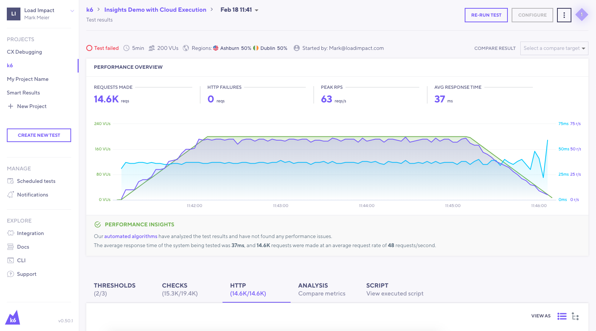

Además de [ejecutar pruebas en k6 Cloud](/cloud/creating-and-running-a-test/cloud-tests-from-the-cli),  también puede ejecutar una prueba localmente y subir los resultados al [k6 Cloud](/cloud).

Al transmitir los resultados a la nube de k6, la máquina donde se ejecuta el comando CLI de k6 ejecuta la prueba y sube los resultados a la nube de k6. A continuación, podrá visualizar y analizar los resultados en la aplicación web en tiempo real.

## Instrucciones


**1 - (Opcional) Iniciar sesión en k6 Cloud**

Suponiendo que haya instalado k6, el primer paso es iniciar sesión en k6 Cloud. Puede utilizar su [token de API](https://app.k6.io/account/api-token) o su nombre de usuario y contraseña:

<CodeGroup labels={["Log in to k6 Cloud", "Log in with username and password"]}>

```bash
$ k6 login cloud --token <YOUR_K6_CLOUD_API_TOKEN>
```

```bash
$ k6 login cloud
```

</CodeGroup>

**2 - Ejecutar las pruebas y subir los resultados**

Ahora, k6 te verificará las credenciales contra k6 Cloud, y puedes usar la opción `--out` para enviar los resultados a k6 Cloud como:

<CodeGroup labels={["Upload results to the k6 Cloud"]}>

```bash
$ k6 run --out cloud script.js
```

</CodeGroup>

Como alternativa, puede omitir el comando de inicio de sesión `k6 login` cuando utilice su [API token](https://app.k6.io/account/api-token) con el comando de ejecución `k6 run` como:

<CodeGroup labels={["Upload results to the k6 Cloud using K6_CLOUD_TOKEN"]}>

```bash
$ K6_CLOUD_TOKEN=<YOUR_K6_CLOUD_API_TOKEN> k6 run --out cloud script.js
```

</CodeGroup>

Después de ejecutar el comando, la consola muestra una URL. Copie esta URL y pégala en la barra de direcciones de su navegador para visualizar los resultados de la prueba.

<CodeGroup labels={[]}>

```bash
execution: local
    output: cloud (https://app.k6.io/runs/721751)
    script: script.js
```

</CodeGroup>



> Cuando envíe los resultados a k6 Cloud, los datos se enviarán continuamente. Mientras esto sucede, el estado de la ejecución de la prueba se marcará como En ejecución. Una prueba que haya finalizado su curso se marcará como Finalizada. El estado de ejecución no tiene nada que ver con que la prueba haya superado algún Threshold, sólo con que la prueba en sí esté funcionando correctamente.
> Si aborta deliberadamente la prueba (por ejemplo, pulsando Ctrl-C), ésta seguirá considerándose Finalizada. Todavía puede ver y analizar los datos de la prueba que ha transmitido hasta ahora. Simplemente, la prueba habrá durado menos de lo previsto originalmente.
> Otra posibilidad sería que perdiera la conexión de red con  k6 Cloud mientras la prueba se está ejecutando. En ese caso,  k6 Cloud esperará hasta que se vuelva a conectar. Mientras tanto, el estado de ejecución de su prueba seguirá apareciendo como "Running" en la aplicación web.
> Si no se produce la reconexión,  k6 Cloud expirará después de dos minutos sin datos, estableciendo el estado de ejecución como Timed out. Podrá seguir analizando una prueba que haya expirada, pero, por supuesto, sólo tendrá acceso a los datos que se hayan transmitido antes del problema de la red.

## Véase también

- [Analyzing results on the k6 Cloud](/cloud/analyzing-results/overview)
- [Running cloud tests](/cloud/creating-and-running-a-test/cloud-tests-from-the-cli)
