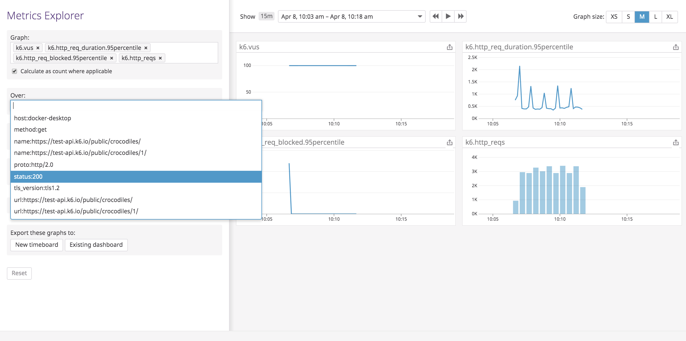
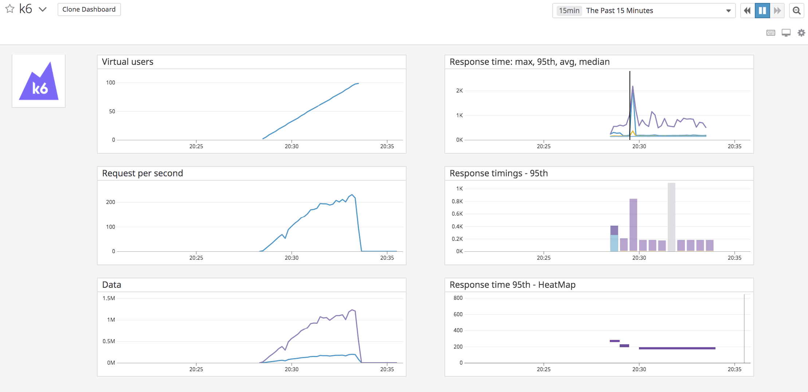

k6 puede enviar métricas de pruebas de rendimiento a [Datadog](https://www.datadoghq.com/). Esto permite visualizar y correlacionar las métricas de pruebas de rendimiento con otras métricas monitorizadas en Datadog.

Este artículo describe las instrucciones de la integración con Datadog:

- Ejecutar el agente de Datadog
- Ejecutar la prueba con k6
- Visualizar en Datadog


## Ejecute el agente Datadog

Para obtener las métricas de k6 en Datadog, k6 envía las métricas a través del Datadog Agent, que recoge, agrega y reenvía las métricas a la plataforma Datadog.

Ejecute el servicio Datadog Agent como un contenedor Docker con este comando:


<CodeGroup labels={[""]}>

```bash
DOCKER_CONTENT_TRUST=1 \
docker run -d \
    --name datadog \
    -v /var/run/docker.sock:/var/run/docker.sock:ro \
    -v /proc/:/host/proc/:ro \
    -v /sys/fs/cgroup/:/host/sys/fs/cgroup:ro \
    -e DD_SITE="datadoghq.com" \
    -e DD_API_KEY=<YOUR_DATADOG_API_KEY> \
    -e DD_DOGSTATSD_NON_LOCAL_TRAFFIC=1 \
    -p 8125:8125/udp \
    datadog/agent:latest
```

</CodeGroup>

Reemplace `<YOUR_DATADOG_API_KEY>` con su [clave API de Datadog](https://app.datadoghq.com/account/settings#api).
Si su cuenta está registrada en Datadog EU, cambie el valor de `DD_SITE` a `datadoghq.eu`.

<blockquote>
Para obtener información adicional, lea la <a href="https://docs.datadoghq.com/agent/docker/">documentación de Datadog Docker Agent</a>.
</blockquote>

### DogStatsD

El agente Datadog incluye el servicio [DogStatsD](https://docs.datadoghq.com/developers/dogstatsd/) para recoger y agregar métricas. DogStatsD implementa el protocolo [StatsD](https://github.com/etsy/statsd) con algunas extensiones. Por ejemplo, el [etiquetado de DogStatsD](https://docs.datadoghq.com/tagging/) permite recopilar métricas de k6 con etiquetas para distinguir entre solicitudes de diferentes URLs, estatus de la respuesta, grupos, etc.

La instrucción anterior ejecuta el servicio `DogStatsD` en un [contenedor Docker](https://docs.datadoghq.com/developers/dogstatsd/?tab=containeragent#agent), pero también es posible ejecutarlo como [Host Agent](https://docs.datadoghq.com/developers/dogstatsd/?tab=hostagent#agent), [Kubernetes](https://docs.datadoghq.com/developers/dogstatsd/?tab=kubernetes#agent), and [Helm](https://docs.datadoghq.com/developers/dogstatsd/?tab=helm#agent).


## Ejecutar el test k6


Una vez que el servicio de Datadog Agent está funcionando, ejecute la prueba con k6 y envíe las métricas al Agent con:

<CodeGroup labels={[""]}>

```bash
$ k6 run --out datadog script.js
```

</CodeGroup>

Las variables de entorno para el comando son:

| Nombre                       | Valor                                                                                                                             |
| -------------------------- | --------------------------------------------------------------------------------------------------------------------------------- |
| `K6_DATADOG_ADDR`          | Dirección del servicio DogsStatsD, actualmente sólo se admite UDP. El valor por defecto es `localhost:8125`.                        |
| `K6_DATADOG_NAMESPACE`     | El espacio de nombres utilizado como prefijo para todos los nombres de las métricas. El valor por defecto es `k6.`                                               |
| `K6_DATADOG_PUSH_INTERVAL` | Configure la frecuencia con la que se envían los lotes de datos. El valor por defecto es `1s`.                                                             |
| `K6_DATADOG_BUFFER_SIZE`   | El tamaño del buffer. El valor por defecto es `20`.                                                                                       |
| `K6_DATADOG_TAG_BLACKLIST` | Es una lista separada por comas de las etiquetas que NO deben enviarse a Datadog. Por ejemplo, "tag1, tag2". El valor por defecto es vacío. |

## Visualización en Datadog

Mientras se ejecuta la prueba, k6 envía métricas periódicamente a Datadog. Por defecto, estas métricas tienen el prefijo k6 como nombre.

Puede visualizar las métricas de k6 en tiempo real con el [explorador de métricas](https://docs.datadoghq.com/metrics/explorer/), [monitores](https://docs.datadoghq.com/monitors/), o [dashboards personalizados](https://docs.datadoghq.com/graphing/dashboards/).



<blockquote>

Para saber más sobre todos los tipos de métricas de k6, lea la guía de [métricas de k6](/using-k6/metrics).

</blockquote>

La primera vez que Datadog detecta la métrica `k6.http_reqs`, la integración de k6 se instala automáticamente, y el panel de control de k6 por defecto se añade a su lista de paneles.



Opcionalmente, puede instalar la integración de k6 siguiendo estas instrucciones:

1. Inicie sesión en `Datadog`.
2. En el menú de la barra lateral, seleccione `Integrations` > `Integrations`.
3. Busque `k6`, luego seleccione la integración con `k6`.
4. Haga clic en la opción de la pestaña `Configuration`.
5. Haga scroll hasta abajo y haga clic en el botón `Install integration`.
