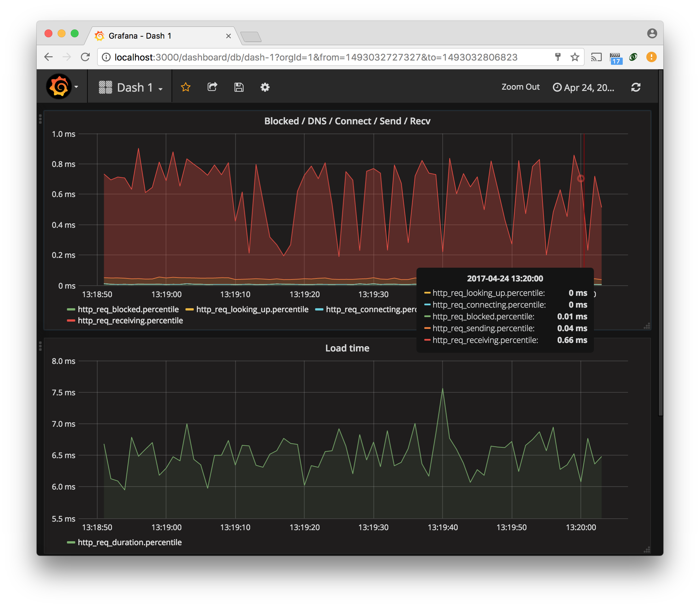
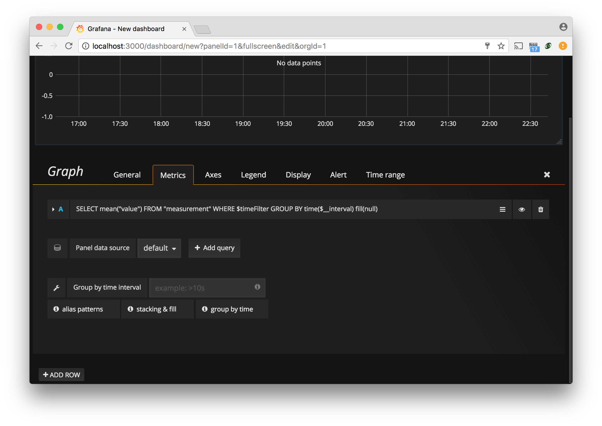
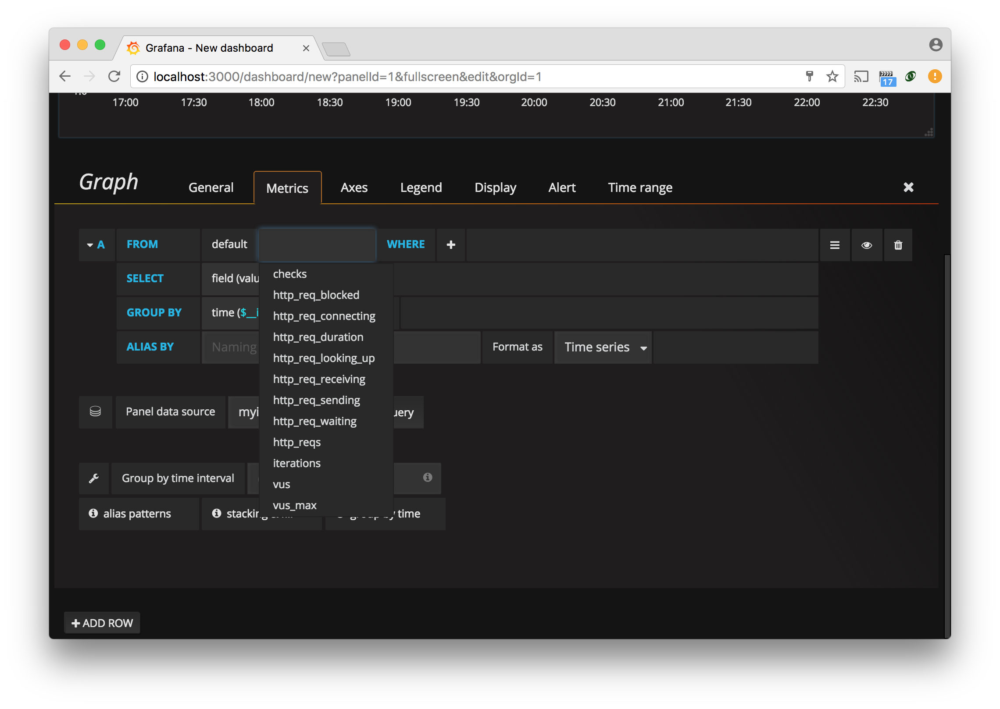
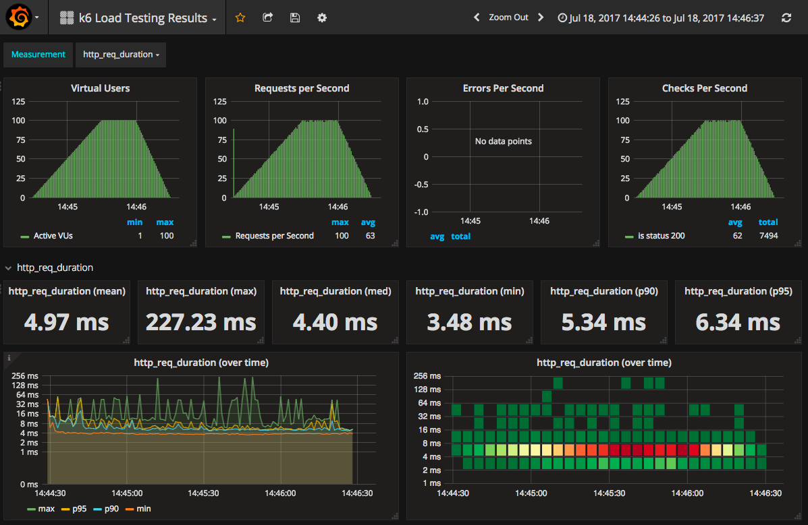

Puedes utilizar [Grafana](https://grafana.com/grafana/) para visualizar las métricas de k6.

El primer paso es subir las métricas de los resultados de las pruebas a un backend de almacenamiento. Y a continuación, configurar Grafana para obtener los datos de su backend para visualizar los resultados de las pruebas.

Este tutorial muestra cómo subir las métricas de los resultados de las pruebas a una instancia de [InfluxDB](https://github.com/influxdata/influxdb) y configurar Grafana para consultar las [métricas de k6](/using-k6/metrics) desde InfluxDB.



## Instalando InfluxDB

Las instrucciones completas de instalación están disponibles en los [documentación de InfluxDB](https://docs.influxdata.com/influxdb/v1.2/introduction/installation/).

<CodeGroup labels={["Linux (Debian/Ubuntu)", "macOS"]}>

```bash
$ sudo apt install influxdb
```

```bash
$ brew install influxdb
```

</CodeGroup>

## Ejecutar la prueba y subir los resultados a InfluxDB

k6 tiene soporte incorporado para la salida de datos de resultados directamente a una base de datos InfluxDB utilizando el interruptor `--out` (`-o`):

<CodeGroup labels={["Linux & MacOS", "Docker"]}>

```bash
$ k6 run --out influxdb=http://localhost:8086/myk6db script.js
```

```bash
$ docker run -i loadimpact/k6 run --out influxdb=http://localhost:8086/myk6db - <script.js
```

</CodeGroup>

La línea de comando anterior hace que k6 se conecte a una instancia local de influxdb, y envíe los resultados de la prueba a una base de datos llamada `myk6db`. Si esta base de datos no existe, k6 la creará automáticamente.

Una vez que tengas los resultados de k6 en tu base de datos InfluxDB, puedes usar Grafana para crear visualizaciones de resultados.

## Instalar Grafana


Las instrucciones completas de instalación están disponibles en la [documentación de Grafana](http://docs.grafana.org/installation/).

<CodeGroup labels={["Linux (Debian/Ubuntu)", "macOS"]}>

```bash
$ sudo apt install grafana
```

```bash
$ brew install grafana
```

</CodeGroup>

Después de la instalación, deberías tener un servidor InfluxDB corriendo en localhost, escuchando en el puerto 886, y un servidor Grafana en `http://localhost:3000`. Ahora, mostramos dos formas diferentes de visualizar tus métricas k6:

- Dashboards personalizados en Grafana
- Dashboards preconfigurados en Grafana

## Dashboards personalizados en Grafana

- Abra http://localhost:3000 (o donde se encuentre su instalación de Grafana) en su navegador.
- `Create a data source`:
  
- Ahora `Create a dashboard`. Aquí está el panel de control recién creado:
  
- Haga clic en `Graph` para crear un nuevo panel gráfico:
  
- Haga clic en el título del Panel y luego en `Edit` para configurar el panel de gráficos:
  
- Establezca la fuente de datos del panel en su base de datos `myk6db` y haga clic en la sentencia `SELECT mean(value)...` para editar la métrica:
  

## Dashboards preconfigurados en Grafana

Aquí vamos a listar las configuraciones de cuadros de mando de Grafana pre-hechos aportados por los usuarios, para su uso con k6.

- [dcadwallader](https://grafana.com/grafana/dashboards/2587)
- [Stian Øvrevåge](https://grafana.com/grafana/dashboards/4411)
- [cyaiox](https://grafana.com/grafana/dashboards/8156)
- [smockvavelsky](https://grafana.com/grafana/dashboards/10553)
- [k m](https://grafana.com/grafana/dashboards/10660)


Habilitar un dashboard colaborativo de Grafana es sencillo: sólo tienes que elegir "import" un dashboard en la interfaz de usuario de Grafana y, a continuación, especificar el número de identificación del dashboard que deseas, puede consultar [http://docs.grafana.org/reference/export_import](http://docs.grafana.org/reference/export_import) para obtener más detalles.




### Usando nuestra configuración de docker-compose

Para hacer todo lo anterior aún más simple, hemos creado una configuración docker-compose que:

- Iniciar un contenedor Docker con InfluxDB
- Iniciar un contenedor Docker con Grafana
- Poner a disposición un contenedor k6 que puede utilizar para ejecutar pruebas de carga

Asegúrate de tener instalada al menos la versión v1.12.0 de docker-compose. Sólo tienes que hacer lo siguiente:


```bash
$ git clone 'https://github.com/loadimpact/k6'
$ cd k6
$ docker-compose up -d \
    influxdb \
    grafana
$ docker-compose run -v \
    $PWD/samples:/scripts \
    k6 run /scripts/es6sample.js
```

Ahora deberías poder conectarte al localhost con el puerto 3000 usando tu navegador y acceder a la instalación de Grafana en el contenedor Docker.

## Opciones de InfluxDB

Al subir los resultados de k6 a InfluxDB (`k6 run --out influxdb=`), puede configurar otras opciones de InfluxDB pasando estas variables de entorno:

| Opciones de InfluxDB             | Descripción
| ---------------------------- | ---------------------------------------------------------------------------------------------------------------------------------------------------------------------------------------------------------------------------------------------------------------------------------------------------------------------------------------------------------------------------------------------------- | ------- |
| `K6_INFLUXDB_USERNAME`       | Nombre de usuario de InfluxDB, opcional
                                                                                                                                                                                                                                                                                                                                                                          |         |
| `K6_INFLUXDB_PASSWORD`       | Contraseña del usuario de InfluxDB                                                                                                                                                                                                                                                                                                                                                                               |         |
| `K6_INFLUXDB_INSECURE`       | Si es verdadero, omitirá la verificación del certificado https                                                                                                                                                                                                                                                                                                                                               | `false` |
| `K6_INFLUXDB_TAGS_AS_FIELDS` |  Un string separado por comas para establecer las métricas de k6 como [campos no indexables](https://docs.influxdata.com/influxdb/v1.8/concepts/glossary/#field) (en lugar de etiquetas). Se puede especificar un tipo opcional usando `:type` como en `vu:int` que hará que el campo sea entero. Los tipos de campo posibles son `int`, `bool`, `float` y `string`, que es el predeterminado. Ejemplo: `vu:int,iter:int,url:string,event_time:int` |         |

## Véase también

- [Tutorial about using k6 with InfluxDB and Grafana](https://k6.io/blog/k6-loves-grafana/)
- [Comparison of k6 test result visualizations](https://k6.io/blog/comparison-of-k6-test-result-visualizations)
