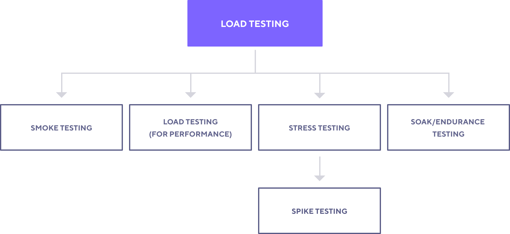

Es posible realizar muchos tipos de pruebas con k6, cada uno de los cuales son usado para un propósito diferente.

Cada tipo de prueba está diseñado para proporcionarle diferentes conocimientos sobre su sistema.

[Smoke Test (Prueba de Humo)](/es/tipos-de-prueba/smoke-testing/): verifica que su sistema puede manejar una carga mínima, sin ningún problema.

[Load Test (Prueba de Carga)](/es/tipos-de-prueba/load-testing/): se ocupa principalmente de evaluar el rendimiento de su sistema en términos de usuarios concurrentes o solicitudes por segundo.

[Stress Test (Prueba de Estrés)](/es/tipos-de-prueba/stress-testing/) y [Spike testing (Prueba de Pico)](/es/tipos-de-prueba/stress-testing/#spike-testing-en-k6): se ocupan de evaluar los límites de su sistema y la estabilidad en condiciones extremas.

[Soak Test (Prueba de Resistencia)](/es/tipos-de-prueba/soak-testing/): le informa sobre la fiabilidad y el rendimiento de su sistema durante un periodo de tiempo prolongado.

Lo importante es entender que cada prueba se puede realizar con el mismo script de prueba. Puedes escribir un script y realizar todas las pruebas anteriores con él. Lo único que cambia es la configuración de la prueba, la lógica permanece igual.

Los diferentes tipos de pruebas le enseñarán diferentes cosas sobre su sistema y le darán la información necesaria para entender y optimizar el rendimiento.

Comience con [Smoke test (Prueba de Humo)](/es/tipos-de-prueba/smoke-testing/) y vea lo fácil que es hacer su primera prueba de carga.
